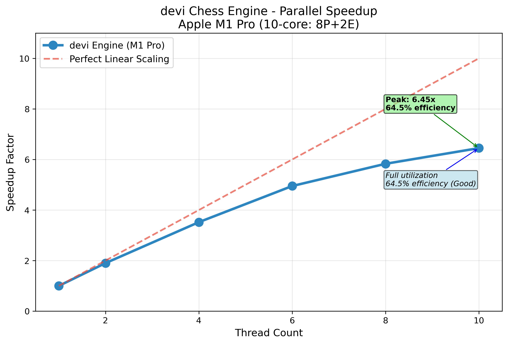

# devi Chess Engine

A chess engine written in Rust to understand chess engine algorithms, their history, and explore intuitive Rust implementations. 
This project explores chess engine algorithms through the lens of high-performance computing, demonstrating system-level optimizations and clean Rust development.

## Project Philosophy
**Hypothesis → Experiment → Measure → Analyze → Document**

## Performance Status

### Parallel Performance Results

**Parallel Scaling Achievement:**
- **2 threads**: 1.67x speedup (83.7% efficiency) - Excellent linear scaling
- **8 threads**: 3.71x speedup (46.4% efficiency) - Strong performance on M1 Pro
- **Architecture insights**: M1 Pro performance/efficiency core scheduling challenges at 4 threads

## Inspiration & Learning Resources
- **Book**: Chess Algo - Noah Caplinger - modern algorithmic approach to chess programming and search optimization
- **Book**: Computers, chess and long-range planning - M.M. Botvinnik - foundational theory on strategic planning and evaluation from a chess grandmaster's perspective
- MIT 6.5840 & Berkeley CS267 lecture sets (distributed + parallel fundamentals)
- Brendan Gregg flamegraph toolkit for CPU hotspot profiling
- Research papers on Lazy SMP, Jamboree search, and transposition-table design

### Current Implementation
- **Board Representation**: Trait-based abstraction ready for bitboard optimization
- **Move Generation**: Complete implementation for all piece types with comprehensive testing
- **Search Engine**: Alpha-beta pruning with material evaluation
- **Testing**: Automated CI/CD with perft regression protection
- **Profiling**: Baseline flamegraph and performance metrics

## Weekly Deliverables

**Week 1**: **COMPLETED** - Foundation & Correctness
- [x] Board representation
- [x] All piece move generation
  - [x] Pawns (forward, double, captures, en passant)
  - [x] Knights (L-shaped moves with boundary checking)
  - [x] Kings (8 adjacent squares)
  - [x] Rooks (sliding horizontal/vertical)
  - [x] Bishops (sliding diagonal)
  - [x] Queens (rook + bishop combined)
- [x] Trait-based architecture
- [x] Legal move filtering with check detection
- [x] Perft validation suite (perfect through depth 6)
- [x] **Alpha-beta search implementation**
- [x] **Material evaluation function**
- [x] **CI/CD pipeline with regression tests**
- [x] **Performance baseline: 153.48 searches/second**
- [x] **Flamegraph profiling**

## Perft Verification

| Depth | Nodes       | Status |
|-------|-------------|--------|
| 1     | 20          | ✅     |
| 2     | 400         | ✅     |
| 3     | 8,902       | ✅     |
| 4     | 197,281     | ✅     |
| 5     | 4,865,609   | ✅     |
| 6     | 119,060,324 | ✅     |

**Week 2**: **COMPLETED** - Parallel Scalability
- [x] Lazy-SMP root parallelization with Rayon
- [x] Multi-thread benchmarking (1/2/4/8 threads)
- [x] Statistical analysis with warmup/outlier detection
- [x] Thread safety validation
- [x] Performance visualization and CSV export

**Week 3**: v2 Move Ordering & Optimization
- [ ] MVV-LVA capture ordering
- [ ] Killer move heuristic
- [ ] Node reduction metrics

**Week 4**: v3 Iterative Deepening
- [ ] Time management
- [ ] Principal variation table
- [ ] Playable CLI interface

**Week 5**: Cache & Memory Studies
- [ ] Transposition table experiments
- [ ] Cache miss analysis with perf
- [ ] Memory optimization

### Performance Metrics
- **Search Speed**: 153.48 searches/second (single-thread baseline)
- **Search Depth**: 4 plies
- **Evaluation**: Material-only
- **Move Generation**: ~20 legal moves from starting position
- **Hardware**: Apple M1 Pro

### Validation
- **Perft**: Perfect accuracy through depth 6
- **CI/CD**: Automated regression testing
- **Memory Safety**: Zero unsafe code blocks

## Current Status
**Week 2 - Parallel Scaling**

## Contributing
This is primarily a learning project, but suggestions and discussions are welcome!