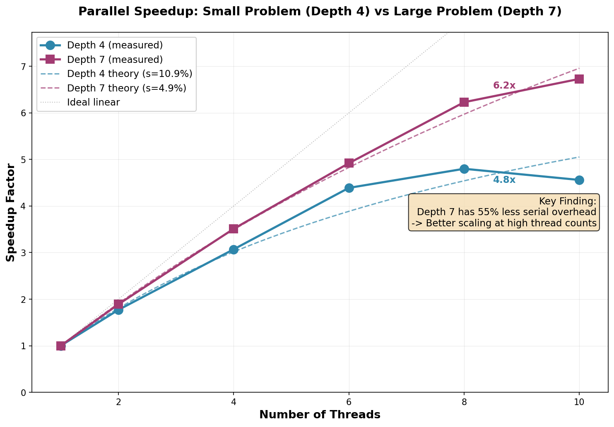
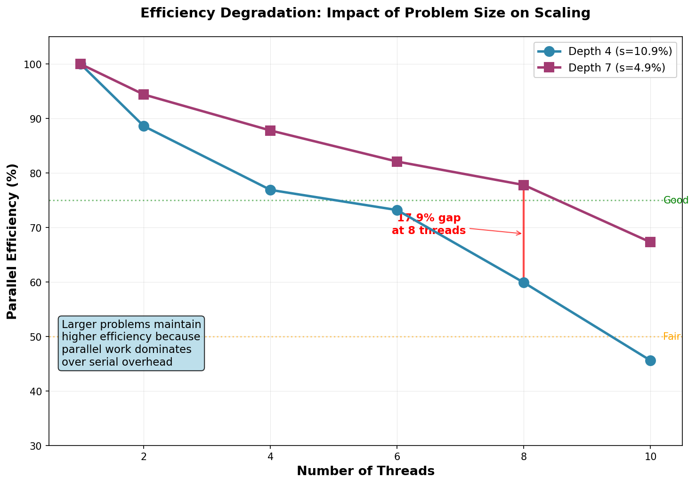

# devi Chess Engine

Building a chess engine from scratch to understand parallel search algorithms and push Rust's performance boundaries.

## Inspiration & Learning Resources
- **Book**: Chess Algo - Noah Caplinger - modern algorithmic approach to chess programming and search optimization
- **Book**: Computers, chess and long-range planning - M.M. Botvinnik - foundational theory on strategic planning and evaluation from a chess grandmaster's perspective
- MIT 6.5840 & Berkeley CS267 lecture sets (distributed + parallel fundamentals)
- Research papers on Lazy SMP, Jamboree search, and transposition-table design

## Project Philosophy
**Approach:** Build it, measure it, understand the bottlenecks.

## Study Timeline
| Version | Focus | Key Result | Details |
|---------|-------|------------|---------|
| [v0.3.0](releases/v0.3.0/) | **Heterogeneous scheduling** | **13× P vs E core gap** | [Brief](releases/v0.3.0/project_brief.md) |
| [v0.4.0](releases/v0.4.0/) | Fault tolerance | All work lost, requires checkpointing. | [Brief](releases/v0.4.0/fault_tolerance_analysis.md) |
| [v0.4.0](releases/v0.4.0/) | **Scaling laws (Amdahl vs Gustafson)** | **48% serial fraction reduction** | [Brief](releases/v0.4.0/scaling_analysis.md) |

## Performance Status


### Parallel Scaling Results (v0.4.0)
**Key Finding**: Larger problems scale better - increasing search depth from 4 to 7 reduces serial fraction by 48%, enabling 6.73× speedup (vs 4.56×) on 10 cores.




### Fault Tolerance Results (v0.4.0)
**Key Finding**: Mid-computation thread failure causes 100% overhead due to Rayon's all-or-nothing model. Establishes baseline for future checkpoint-based recovery.

| Scenario | Time (ms) | Overhead | Best Move | Notes |
|----------|-----------|----------|-----------|-------|
| Baseline | 416.5 | 0% | f2f4 | Direct parallel search |
| Wrapper only | 437.0 | +4.9% | f2f4 | Negligible wrapper cost |
| **With panic** | **833.6** | **+100.1%** | **f2f4** | **All parallel work lost** |
| Double work | 884.5 | +112.4% | f2f4 | Validation baseline |

```
M1 Pro | Depth comparison

Policy          Searches/sec    Relative    
None (OS)       2.23            100%        
FastBias        2.29            103%        
EfficientBias   0.18            8%     <- 13× slower
Mixed           1.08            48%    <- Critical-path bottleneck
```


## Quick Start

```bash
# Clone and build
git clone https://github.com/Sid4mn/devi-chess-engine.git
cd devi-chess-engine && cargo build --release

# Reproduce scaling analysis
./scripts/analysis/multi_depth_scaling.sh

# Or run specific benchmarks
./target/release/devi --benchmark --benchmark-sweep --depth 7
```

### Performance Results
- **Single thread baseline**: 0.37 searches/sec (depth 7)
- **Peak speedup**: 6.73× on 10 threads (depth 7, 67.3% efficiency)
- **Sweet spot**: 6.23× on 8 P-cores (depth 7, 77.8% efficiency)
- **Methodology**: 5 warmup + 10 measurement runs, median timing with std dev reporting

**Hardware**: Apple M1 Pro (8 performance + 2 efficiency cores), lock-free parallel search via Rayon

### CLI Usage

#### Fault Tolerance Analysis
```bash
# Full overhead characterization (4 scenarios)
./target/release/devi --fault-analysis --depth 7 --threads 8
# Output: benchmarks/fault_overhead.csv

# Quick recovery test
cargo run --release -- --recovery-analysis --depth 6
```

#### Scaling Analysis
```bash
# Compare Amdahl (depth 4) vs Gustafson (depth 7)
./scripts/analysis/multi_depth_scaling.sh

# Individual depth testing
cargo run --release -- --benchmark --benchmark-sweep --depth 4
cargo run --release -- --benchmark --benchmark-sweep --depth 7
```

#### Heterogeneous Scheduling
```bash
# Test specific core policies
cargo run --release -- --benchmark --depth 7 --threads 8 --core-policy fast
cargo run --release -- --benchmark --depth 7 --threads 8 --core-policy efficient
cargo run --release -- --benchmark --depth 7 --threads 8 --core-policy mixed --mixed-ratio 0.8
```

### Standard Benchmarking
```bash
# Thread sweep with CSV output
cargo run --release -- --benchmark --benchmark-sweep --csv-output results.csv

# Stability testing  
cargo run --release -- --soak --threads 8 --depth 6 --runs 100

# Thread scaling analysis
./scripts/threads.sh

# Perft testing (move generation validation)
cargo run --release -- --perft --depth 6

# Parallel perft testing
cargo run --release -- --perft --parallel-perft --threads 10 --depth 6

# Perft divide (debug individual moves)
cargo run --release -- --perft --perft-divide --depth 5

# Fault tolerance testing
cargo run --release -- --threads 4 --depth 4 --inject-panic 0

# Comprehensive fault analysis
cargo run --release -- --threads 4 --depth 4 --inject-panic 0 --dump-crashes
```

### Advanced Options
```bash
# Benchmark with custom parameters
cargo run --release -- --benchmark --warmup 10 --runs 20 --depth 5

# Soak test with detailed statistics
cargo run --release -- --soak --threads 4 --depth 4 --runs 50

# Serial vs Parallel perft comparison
cargo run --release -- --perft --threads 1 --depth 7 # Serial
cargo run --release -- --perft --parallel-perft --threads 8 --depth 7 # Parallel

# Fault tolerance automation
./scripts/run_fault.sh
```

### Flag Reference
| Flag | Description | Default |
|------|-------------|---------|
| `--threads` | Number of threads to use | 1 |
| `--depth` | Search depth | 4 |
| `--benchmark-sweep` | Test all thread counts [1,2,4,6,8,10] | - |
| `--core-policy` | Scheduling policy {none\|fast\|efficient\|mixed} | none |
| `--mixed-ratio` | Ratio of P-cores in mixed mode | 0.80 |
| `--csv-output` | Export results to CSV | - |
| `--warmup` | Warmup iterations for benchmarks | 5 |
| `--runs` | Number of measurement runs | 10 |
| `--benchmark` | Run full benchmark suite | - |
| `--soak` | Run stability soak test | - |
| `--perft` | Run perft move generation test | - |
| `--parallel-perft` | Use parallel perft computation | false |
| `--perft-divide` | Show perft results per root move | - |
| `--fault-analysis` | Run 4-scenario fault overhead analysis | - |
| `--recovery-analysis` | Quick fault recovery test | - |

## Deliverables

Foundation & Correctness **COMPLETED** 
- [x] Board representation
- [x] All piece move generation
  - [x] Pawns (forward, double, captures, en passant)
  - [x] Knights (L-shaped moves with boundary checking)
  - [x] Kings (8 adjacent squares)
  - [x] Rooks (sliding horizontal/vertical)
  - [x] Bishops (sliding diagonal)
  - [x] Queens (rook + bishop combined)
- [x] Trait-based architecture
- [x] Legal move filtering with check detection
- [x] Perft validation suite (verified through depth 7)
- [x] **Alpha-beta search implementation**
- [x] **Material evaluation function**
- [x] **CI/CD pipeline with regression tests**
- [x] **Flamegraph profiling**

## Perft Verification

| Depth | Nodes         | Status |
|-------|-------------  |------- |
| 1     | 20            |   ✅   |
| 2     | 400           |   ✅   |
| 3     | 8,902         |   ✅   |
| 4     | 197,281       |   ✅   |
| 5     | 4,865,609     |   ✅   |
| 6     | 119,060,324   |   ✅   |
| 7     | 3,195,901,860 |   ✅   |


Parallel Scalability **COMPLETED**
- [x] Root parallelization with Rayon
- [x] Multi-thread benchmarking (1/2/4/8/10 threads)
- [x] CLI with clap
- [x] Comprehensive benchmark suite (--benchmark flag)
- [x] Soak testing for stability validation (--soak flag)
- [x] Statistical analysis with warmup/outlier detection
- [x] Performance visualization and CSV export
- [x] **Automated reproduction scripts (threads.sh, soak.sh)**

Fault Tolerance **COMPLETED**
- [x] Panic recovery wrapper with catch_unwind
- [x] Real work injection (2-ply before panic)
- [x] 4-scenario overhead characterization
- [x] Correctness preservation across retries
- [x] CSV export and analysis documentation
- [x] Baseline for future checkpoint-based recovery

Heterogeneous Core Scheduling **COMPLETED**
- [x] QoS-based thread biasing for P/E core scheduling
- [x] Four scheduling policies (None, FastBias, EfficientBias, Mixed)
- [x] Mixed policy bottleneck analysis (48% vs expected 75%)
- [x] Automated heterogeneous benchmarking (heterogeneous.sh)

## Future Work

1. **Checkpoint-based recovery** - reduce overhead from 100% to ~15-30%
2. **Work-stealing scheduler** with separate P/E core pools
3. **Heterogeneity-aware orchestrator** routing heavy subtrees to P-cores  
4. **Partitioned transposition tables** - hot entries on P-core caches, cold on E-cores
5. **PV-split parallelization** with core-aware work distribution (PV nodes -> P-cores)
6. **Opening book** and endgame tablebase integration

### Fault Tolerance Results
```
timestamp,depth,threads,scenario,median_ms,overhead_pct,move,score,min_ms,max_ms
2025-11-05_18:45:58,7,10,baseline,416.541,0.00,f2f4,0,385.068,449.377
2025-11-05_18:45:58,7,10,zero_overhead,436.952,4.90,f2f4,0,428.033,446.038
2025-11-05_18:45:58,7,10,with_panic,833.579,100.12,f2f4,0,813.217,899.359
2025-11-05_18:45:58,7,10,double_work,884.543,112.35,f2f4,0,861.157,900.324
,,,,,,,,,
```

## Release History
- **[v0.4.0](releases/v0.4.0/)**: Amdahl vs Gustafson scaling analysis - 48% serial fraction reduction
- **[v0.3.0](releases/v0.3.0/)**: Add Heterogeneous core scheduling policies
- **[v0.2.3-fault](releases/v0.2.3-fault/)**: Fault tolerance with panic recovery

## Contributing
This is primarily a learning project, but suggestions and discussions are welcome!

*Contact: sid4mndev@gmail.com | [GitHub](https://github.com/Sid4mn/devi-chess-engine)*
