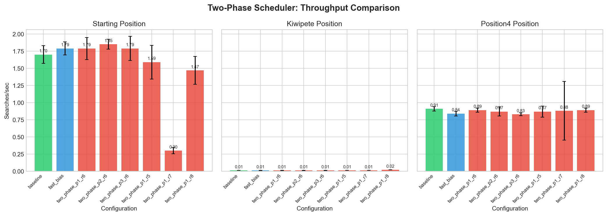
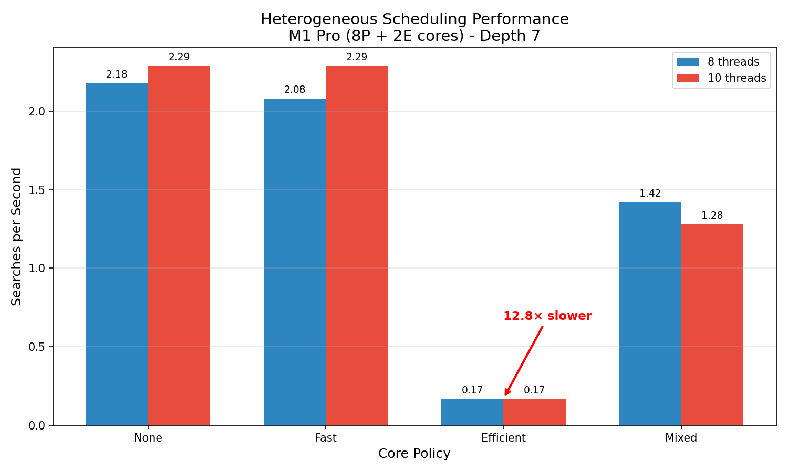

# devi Chess Engine

Building a chess engine from scratch to understand parallel search algorithms and push Rust's performance boundaries.

## Inspiration & Learning Resources

### Chess Algorithms
- **Book**: *Chess Algo* - Noah Caplinger - Modern algorithmic approach to chess programming and search optimization
- **Book**: *Computers, Chess and Long-Range Planning* - M.M. Botvinnik - Foundational theory on strategic planning and evaluation from a chess grandmaster's perspective
- Research papers on Lazy SMP, Jamboree search, and transposition-table design

### Systems & Parallel Computing
- **Paper**: [*The Tail at Scale*](https://research.google/pubs/pub40801/) (Dean & Barroso, 2013) - Latency characterization motivates P/E heterogeneity analysis
- **Paper**: [*Harness*](https://mehmet.belviranli.com/papers/ics25.pdf) (Belviranli et al., ICS 2025) - Pattern-based work classification concept adapted for chess move categorization via PV probe
- **Lectures**: [MIT 6.5840](https://pdos.csail.mit.edu/6.824/) & [Berkeley CS267](https://sites.google.com/lbl.gov/cs267-spr2024) - Distributed and parallel computing fundamentals

## Project Philosophy
**Approach:** Build it, measure it, understand the bottlenecks.

## Performance Status (v0.5.0)


## v0.5.0 - Two-Phase Heterogeneous Scheduler

Built on v0.4.0's finding that E-cores are 12.8x slower - instead of fighting the OS scheduler, I classify moves by subtree size and dispatch to the right cores.

**1.55x speedup** on complex positions (Kiwipete, 48 moves) with probe_depth=1, ratio=0.8



```
Kiwipete (48 moves):
  Baseline (8 P-cores): 69.4s
  Two-phase (8P + 2E):  44.9s (1.55x faster)

Key: E-cores get the alpha bound from Phase 1, so they prune aggressively.
```

**Failure discovered**: ratio=0.7 on starting position -> 0.18x (5.6x slower). Wrong ratio is catastrophic.

[Summary](releases/v0.5.0/two_phase_summary.md) | [Details](releases/v0.5.0/two_phase_detailed.md)

## v0.4.0 - Performance Characterization

Three studies on parallel chess search:

### 1. Fault Tolerance
**100% overhead** - Rayon's all-or-nothing model discards all parallel work on panic.

[Details](releases/v0.4.0/fault_tolerance_analysis.md)

### 2. Scaling Laws
**48% serial reduction** (depth 4 -> 7) - Gustafson's Law dominates as problems scale.


[Details](releases/v0.4.0/scaling_analysis.md)

### 3. Heterogeneous Scheduling
**12.8x P/E gap** - E-cores unsuitable for branch-heavy search.


```
8 threads | Depth 7:
  P-cores (Fast):     2.08 searches/sec
  E-cores (Efficient): 0.17 searches/sec (12.8x slower)
  Mixed (80/20):       1.42 searches/sec (65% vs 78% expected)
```
[Details](releases/v0.4.0/core_pinning_analysis.md)

## Quick Start
```bash
# Clone and build
git clone https://github.com/Sid4mn/devi-chess-engine.git
cd chess-engine-rust && cargo build --release

# Reproduce all v0.4.0 analyses
./target/release/devi --fault-analysis --depth 7 --threads 8
./scripts/analysis/multi_depth_scaling.sh  
./scripts/heterogeneous.sh
```

### Performance Results
- **Single thread baseline**: 0.37 searches/sec (depth 7)
- **Peak speedup**: 6.73x on 10 threads (depth 7, 67.3% efficiency)
- **Sweet spot**: 6.23x on 8 P-cores (depth 7, 77.8% efficiency)
- **Methodology**: 5 warmup + 10 measurement runs, median timing with std dev reporting

**Hardware**: Apple M1 Pro (8 performance + 2 efficiency cores), lock-free parallel search via Rayon

### CLI Usage

#### Fault Tolerance Analysis
```bash
# Full overhead characterization (4 scenarios)
./target/release/devi --fault-analysis --depth 7 --threads 8
# Output: benchmarks/fault_overhead.csv

# Quick recovery test
cargo run --release -- --recovery-analysis --depth 6
```

#### Scaling Analysis
```bash
# Compare Amdahl (depth 4) vs Gustafson (depth 7)
./scripts/analysis/multi_depth_scaling.sh

# Individual depth testing
cargo run --release -- --benchmark --benchmark-sweep --depth 4
cargo run --release -- --benchmark --benchmark-sweep --depth 7
```

#### Heterogeneous Scheduling
```bash
# Test specific core policies
cargo run --release -- --benchmark --depth 7 --threads 8 --core-policy fast
cargo run --release -- --benchmark --depth 7 --threads 8 --core-policy efficient
cargo run --release -- --benchmark --depth 7 --threads 8 --core-policy mixed --mixed-ratio 0.8
```

### Standard Benchmarking
```bash
# Thread sweep with CSV output
cargo run --release -- --benchmark --benchmark-sweep --csv-output results.csv

# Stability testing  
cargo run --release -- --soak --threads 8 --depth 6 --runs 100

# Thread scaling analysis
./scripts/threads.sh

# Perft testing (move generation validation)
cargo run --release -- --perft --depth 6

# Parallel perft testing
cargo run --release -- --perft --parallel-perft --threads 10 --depth 6

# Perft divide (debug individual moves)
cargo run --release -- --perft --perft-divide --depth 5

# Fault tolerance testing
cargo run --release -- --threads 4 --depth 4 --inject-panic 0

# Comprehensive fault analysis
cargo run --release -- --threads 4 --depth 4 --inject-panic 0 --dump-crashes
```

### Advanced Options
```bash
# Benchmark with custom parameters
cargo run --release -- --benchmark --warmup 10 --runs 20 --depth 5

# Soak test with detailed statistics
cargo run --release -- --soak --threads 4 --depth 4 --runs 50

# Serial vs Parallel perft comparison
cargo run --release -- --perft --threads 1 --depth 7 # Serial
cargo run --release -- --perft --parallel-perft --threads 8 --depth 7 # Parallel

# Fault tolerance automation
./scripts/run_fault.sh
```

### Flag Reference
| Flag | Description | Default |
|------|-------------|---------|
| `--threads` | Number of threads to use | 1 |
| `--depth` | Search depth | 4 |
| `--benchmark-sweep` | Test all thread counts [1,2,4,6,8,10] | - |
| `--core-policy` | Scheduling policy {none\|fast\|efficient\|mixed} | none |
| `--mixed-ratio` | Ratio of P-cores in mixed mode | 0.80 |
| `--csv-output` | Export results to CSV | - |
| `--warmup` | Warmup iterations for benchmarks | 5 |
| `--runs` | Number of measurement runs | 10 |
| `--benchmark` | Run full benchmark suite | - |
| `--soak` | Run stability soak test | - |
| `--perft` | Run perft move generation test | - |
| `--parallel-perft` | Use parallel perft computation | false |
| `--perft-divide` | Show perft results per root move | - |
| `--fault-analysis` | Run 4-scenario fault overhead analysis | - |
| `--recovery-analysis` | Quick fault recovery test | - |
| `--two-phase` | Enable two-phase heterogeneous scheduling | false |
| `--two-phase-benchmark` | Run two-phase benchmark suite | false |
| `--probe-depth` | Depth for move classification probe | 1 |
| `--p-cores` | P-core threads for Phase 1 | 8 |
| `--e-cores` | E-core threads for Phase 2 | 2 |

## Deliverables

Foundation & Correctness **COMPLETED** 
- [x] Board representation
- [x] All piece move generation
  - [x] Pawns (forward, double, captures, en passant)
  - [x] Knights (L-shaped moves with boundary checking)
  - [x] Kings (8 adjacent squares)
  - [x] Rooks (sliding horizontal/vertical)
  - [x] Bishops (sliding diagonal)
  - [x] Queens (rook + bishop combined)
- [x] Trait-based architecture
- [x] Legal move filtering with check detection
- [x] Perft validation suite (verified through depth 8)
- [x] **Alpha-beta search implementation**
- [x] **Material evaluation function**
- [x] **CI/CD pipeline with regression tests**
- [x] **Flamegraph profiling**

## Perft Verification

| Depth | Nodes         | Status |
|-------|-------------  |------- |
| 1     | 20            | [PASS] |
| 2     | 400           | [PASS] |
| 3     | 8,902         | [PASS] |
| 4     | 197,281       | [PASS] |
| 5     | 4,865,609     | [PASS] |
| 6     | 119,060,324   | [PASS] |
| 7     | 3,195,901,860 | [PASS] |
| 8     | 84,998,978,956 | [PASS] |


Parallel Scalability **COMPLETED**
- [x] Root parallelization with Rayon
- [x] Multi-thread benchmarking (1/2/4/8/10 threads)
- [x] CLI with clap
- [x] Comprehensive benchmark suite (--benchmark flag)
- [x] Soak testing for stability validation (--soak flag)
- [x] Statistical analysis with warmup/outlier detection
- [x] Performance visualization and CSV export
- [x] **Automated reproduction scripts (threads.sh, soak.sh)**

Fault Tolerance **COMPLETED**
- [x] Panic recovery wrapper with catch_unwind
- [x] Real work injection (2-ply before panic)
- [x] 4-scenario overhead characterization
- [x] Correctness preservation across retries
- [x] CSV export and analysis documentation
- [x] Baseline for future checkpoint-based recovery

Heterogeneous Core Scheduling **COMPLETED**
- [x] QoS-based thread biasing for P/E core scheduling
- [x] Four scheduling policies (None, FastBias, EfficientBias, Mixed)
- [x] Mixed policy bottleneck analysis (48% vs expected 75%)
- [x] Automated heterogeneous benchmarking (heterogeneous.sh)

Two-Phase Scheduler **COMPLETED** (v0.5.0)
- [x] Probe-based move classification by subtree size
- [x] Separate P-core and E-core thread pools
- [x] Alpha-bound handoff for E-core pruning
- [x] Adaptive heuristic (should_use_two_phase)
- [x] Failure mode analysis (0.7 ratio disaster)

## Future Work

1. **Checkpoint-based recovery** - reduce overhead from 100% to ~15-30%
2. **Work-stealing scheduler** with separate P/E core pools
3. **Heterogeneity-aware orchestrator** routing heavy subtrees to P-cores  
4. **Partitioned transposition tables** - hot entries on P-core caches, cold on E-cores
5. **PV-split parallelization** with core-aware work distribution (PV nodes -> P-cores)
6. **Opening book** and endgame tablebase integration

## Raw Data

### Fault Tolerance (v0.4.0)
```csv
timestamp,depth,threads,scenario,median_ms,overhead_pct,move,score
2025-11-05_18:45:58,7,8,baseline,416.541,0.00,f2f4,0
2025-11-05_18:45:58,7,8,with_panic,833.579,100.12,f2f4,0
```

### Heterogeneous Scheduling (v0.4.0)  
```csv
timestamp,threads,policy,median_ms,searches_per_sec
2025-11-05_21:57:21,8,None,458.121,2.18
2025-11-05_21:57:29,8,FastBias,480.478,2.08
2025-11-05_21:59:06,8,EfficientBias,5961.903,0.17
2025-11-05_21:59:17,8,Mixed,704.135,1.42
```

## Future Directions

**Checkpoint Recovery** - Per-thread root-level checkpointing with `catch_unwind` to preserve completed move evaluations on panic. Target: ≤30% overhead (vs current 100% full retry).

**Transposition Table** - Memoization for 5-10x speedup. Intentionally omitted in v0.5.0 to isolate the scheduling research question.

## Contributing
This is primarily a learning project, but suggestions and discussions are welcome!

*Contact: sid4mndev@gmail.com | [GitHub](https://github.com/Sid4mn/devi-chess-engine)*
