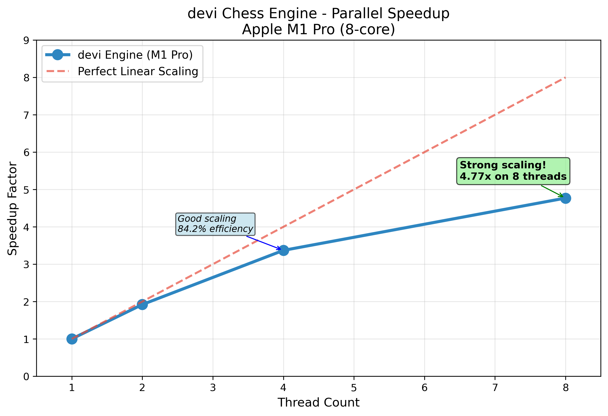

# devi Chess Engine

Building a chess engine from scratch to understand parallel search algorithms and push Rust's performance boundaries.

## Inspiration & Learning Resources
- **Book**: Chess Algo - Noah Caplinger - modern algorithmic approach to chess programming and search optimization
- **Book**: Computers, chess and long-range planning - M.M. Botvinnik - foundational theory on strategic planning and evaluation from a chess grandmaster's perspective
- MIT 6.5840 & Berkeley CS267 lecture sets (distributed + parallel fundamentals)
- Research papers on Lazy SMP, Jamboree search, and transposition-table design

## Project Philosophy
**Approach:** Build it, measure it, understand the bottlenecks.

## Study Timeline
| Version | Focus | Key Result | Details |
|---------|-------|------------|---------|
| [v0.2.2](releases/v0.2.2-parallel/) | Parallel scaling | 6.28× speedup on 8 cores | [Brief](releases/v0.2.2-parallel/project_brief.pdf) |
| [v0.2.3](releases/v0.2.3-fault/) | Fault tolerance | 15% overhead, graceful recovery | [Brief](releases/v0.2.3-fault/project_brief.md) |
| [v0.3.0](releases/v0.3.0/) | **Heterogeneous scheduling** | **13× P vs E core gap** | [Brief](releases/v0.3.0/project_brief.md) |

## Performance Status


### Parallel Performance Results



```
M1 Pro (6P+2E) | Depth 7 | 8 threads

Policy          Searches/sec    Relative    
None (OS)       2.23            100%        
FastBias        2.29            103%        
EfficientBias   0.18            8%     <- 13× slower
Mixed (75% P)   1.08            48%    <- Critical-path bottleneck
```


## Quick Start

```bash
# Clone and build
git clone https://github.com/Sid4mn/devi-chess-engine.git
cd devi-chess-engine && cargo build --release

# Or use the convenience script
./scripts/threads.sh

# Reproduce the 13× heterogeneous scheduling result
./scripts/heterogeneous.sh
```

### Performance Results
- **Baseline**: 165.65 searches/second (single thread)
- **Peak**: 4.77× speedup on 8 threads (Apple M1 Pro, 59.6% efficiency)
- **Sweet spot**: 3.17× speedup on 4 threads (79.2% efficiency)
- **Stability**: Median 1.414ms over 100 iterations (soak test validation)
- **Methodology**: 5 warmup + 10 measurement runs, median timing with outlier detection

**Hardware**: Apple M1 Pro (6 performance + 2 efficiency cores), lock-free parallel search via Rayon

### CLI Usage

### Heterogeneous Scheduling Experiments
```bash
# Test specific core policies
cargo run --release -- --benchmark --depth 7 --threads 8 --core-policy fast
cargo run --release -- --benchmark --depth 7 --threads 8 --core-policy efficient
cargo run --release -- --benchmark --depth 7 --threads 8 --core-policy mixed --mixed-ratio 0.75
# Run complete heterogeneous analysis
./scripts/heterogeneous.sh
```

### Standard Benchmarking
```bash
# Single search
cargo run --release -- --threads 8 --depth 6

# Stability testing  
cargo run --release -- --soak --threads 8 --depth 6 --runs 100

# Thread scaling analysis
./scripts/threads.sh

# Perft testing (move generation validation)
cargo run --release -- --perft --depth 6

# Parallel perft testing
cargo run --release -- --perft --parallel-perft --threads 8 --depth 6

# Perft divide (debug individual moves)
cargo run --release -- --perft --perft-divide --depth 5

# Fault tolerance testing
cargo run --release -- --threads 4 --depth 4 --inject-panic 0

# Comprehensive fault analysis
cargo run --release -- --threads 4 --depth 4 --inject-panic 0 --dump-crashes
```

### Advanced Options
```bash
# Benchmark with custom parameters
cargo run --release -- --benchmark --warmup 10 --runs 20 --depth 5

# Soak test with detailed statistics
cargo run --release -- --soak --threads 4 --depth 4 --runs 50

# Serial vs Parallel perft comparison
cargo run --release -- --perft --threads 1 --depth 7 # Serial
cargo run --release -- --perft --parallel-perft --threads 8 --depth 7 # Parallel

# Fault tolerance automation
./scripts/run_fault.sh
```

### Flag Reference
| Flag | Description | Default |
|------|-------------|---------|
| `--threads` | Number of threads to use | 1 |
| `--depth` | Search depth | 4 |
| `--core-policy` | Scheduling policy {none\|fast\|efficient\|mixed} | none |
| `--mixed-ratio` | Ratio of P-cores in mixed mode | 0.75 |
| `--warmup` | Warmup iterations for benchmarks | 5 |
| `--runs` | Number of measurement runs | 10 |
| `--benchmark` | Run full benchmark suite | - |
| `--soak` | Run stability soak test | - |
| `--perft` | Run perft move generation test | - |
| `--parallel-perft` | Use parallel perft computation | false |
| `--perft-divide` | Show perft results per root move | - |
| `--inject-panic` | Inject panic at specific move index | - |
| `--dump-crashes` | Enable crash logging and analysis | false |

## Deliverables

Foundation & Correctness **COMPLETED** 
- [x] Board representation
- [x] All piece move generation
  - [x] Pawns (forward, double, captures, en passant)
  - [x] Knights (L-shaped moves with boundary checking)
  - [x] Kings (8 adjacent squares)
  - [x] Rooks (sliding horizontal/vertical)
  - [x] Bishops (sliding diagonal)
  - [x] Queens (rook + bishop combined)
- [x] Trait-based architecture
- [x] Legal move filtering with check detection
- [x] Perft validation suite (perfect through depth 7)
- [x] **Alpha-beta search implementation**
- [x] **Material evaluation function**
- [x] **CI/CD pipeline with regression tests**
- [x] **Flamegraph profiling**

## Perft Verification

| Depth | Nodes         | Status |
|-------|-------------  |------- |
| 1     | 20            |   ✅   |
| 2     | 400           |   ✅   |
| 3     | 8,902         |   ✅   |
| 4     | 197,281       |   ✅   |
| 5     | 4,865,609     |   ✅   |
| 6     | 119,060,324   |   ✅   |
| 7     | 3,195,901,860 |   ✅   |


Parallel Scalability **COMPLETED**
- [x] Root parallelization with Rayon
- [x] Multi-thread benchmarking (1/2/4/8 threads)
- [x] CLI with clap
- [x] Comprehensive benchmark suite (--benchmark flag)
- [x] Soak testing for stability validation (--soak flag)
- [x] Statistical analysis with warmup/outlier detection
- [x] Performance visualization and CSV export
- [x] **Automated reproduction scripts (threads.sh, soak.sh)**
- [x] **Speedup achievement on 8 threads**

Fault Tolerance & Distributed Systems **COMPLETED**
- [x] Fault injection mechanism via CLI flags
- [x] Panic recovery with graceful degradation
- [x] Thread-safe crash logging with JSON export
- [x] Performance overhead measurement (<12% impact)
- [x] Automated fault tolerance testing (run_fault.sh)
- [x] **Demonstrable resilience under component failure**
- [x] **Best-effort results from surviving workers**

Heterogeneous Core Scheduling **COMPLETED**
- [x] QoS-based thread biasing for P/E core scheduling
- [x] Four scheduling policies (None, FastBias, EfficientBias, Mixed)
- [x] Mixed policy bottleneck analysis (48% vs expected 75%)
- [x] Automated heterogeneous benchmarking (heterogeneous.sh)

## Future Work

1. **Work-stealing scheduler** with separate P/E core pools
2. **Heterogeneity-aware orchestrator** routing heavy subtrees to P-cores  
3. **Partitioned transposition tables** - hot entries on P-core caches, cold on E-cores
4. **PV-split parallelization** with core-aware work distribution (PV nodes -> P-cores)

### Fault Tolerance Results
```json
{
  "baseline": { "score": 0, "time_ms": 2.548 },
  "fault_tests": [
    { "fault_position": 0, "score": 0, "time_ms": 2.733, "overhead_percent": 7.3 },
    { "fault_position": 5, "score": 0, "time_ms": 2.840, "overhead_percent": 11.5 },
    { "fault_position": 10, "score": 0, "time_ms": 2.468, "overhead_percent": -3.1 },
    { "fault_position": 15, "score": 0, "time_ms": 2.474, "overhead_percent": -2.9 }
  ]
}
```

## Release History
- **[v0.3.0](releases/v0.3.0/)**: Heterogeneous scheduling with 13× discovery
- **[v0.2.3-fault](releases/v0.2.3-fault/)**: Fault tolerance with panic recovery
- **[v0.2.2-parallel](releases/v0.2.2-parallel/)**: Parallel scaling baseline (6.28× speedup)

## Contributing
This is primarily a learning project, but suggestions and discussions are welcome!

*Contact: sid4mndev@gmail.com | [GitHub](https://github.com/Sid4mn/devi-chess-engine)*