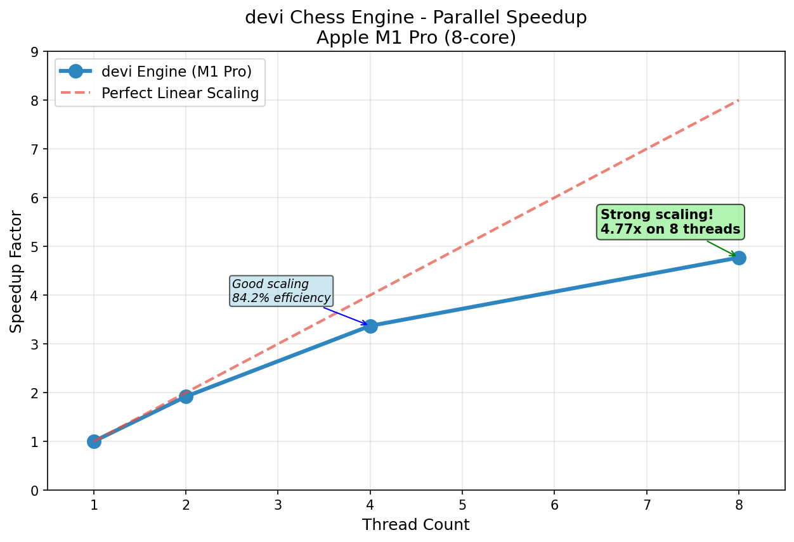

# Parallel Scaling of Alpha-Beta Tree Search (Rust + Rayon)
*A reproducible HPC probe for irregular tree search on an 8-core CPU.*

**Motivation.** Irregular, branchy tree search stresses parallel runtimes via load imbalance and dynamic work distribution. My aim is a **clean, reproducible** scaling measurement-not a top chess engine. Consistent with **Amdahl's law**, small serial fractions bound speedup as cores increase. This project serves as a research probe for understanding parallel efficiency limits in tree-structured computations.

**Implementation.** Perft-validated Rust engine (correct through depth 7); fixed-depth alpha-beta (d=4); **Lazy-SMP root split** via Rayon with lock-free parallel search. Benchmarks on **Apple M1 Pro (8-core: 6 performance + 2 efficiency)** with 5 warmup + 10 measurement runs per configuration. Statistical robustness via median timing and outlier detection.

**Results.**
| Threads | Searches/s (d=4) | Speedup | Efficiency |
|--------:|------------------:|--------:|-----------:|
| 1       | 165.65            | 1.00×   | 100.0%     |
| 2       | 289.39            | 1.75×   | 87.4%      |
| 4       | 524.52            | 3.17×   | 79.2%      |
| 8       | 790.20            | **4.77×** | **59.6%** |




*Amdahl view.* Scaling 1→8 threads reached **4.77×**; a simple fit implies a serial fraction ≈ **0.10**, matching the observed efficiency ceiling. The 59.6% efficiency at 8 threads reflects typical memory subsystem contention and synchronization overhead in shared-memory parallel search.

**Stability Validation.** Soak test (100 iterations, 8 threads): median 1.414ms, p95 2.268ms, showing the engine doesn't degrade under sustained load.

**Reproducibility.** Tagged release: **v0.2.2** with artifacts.
```bash
git clone https://github.com/Sid4mn/devi-chess-engine.git
cd devi-chess-engine && git checkout v0.2.2
./scripts/threads.sh   # regenerates benchmarks/speedup.csv and benchmarks/speedup.png
```

**Next Steps.** (1) Compare root-only split vs shallow PV-split to quantify split-point effects on load imbalance. (2) Implement fault-tolerant search with panic recovery to study resilience overhead in parallel tree search.

---
*Contact: sid4mndev@gmail.com | GitHub: https://github.com/Sid4mn/devi-chess-engine*