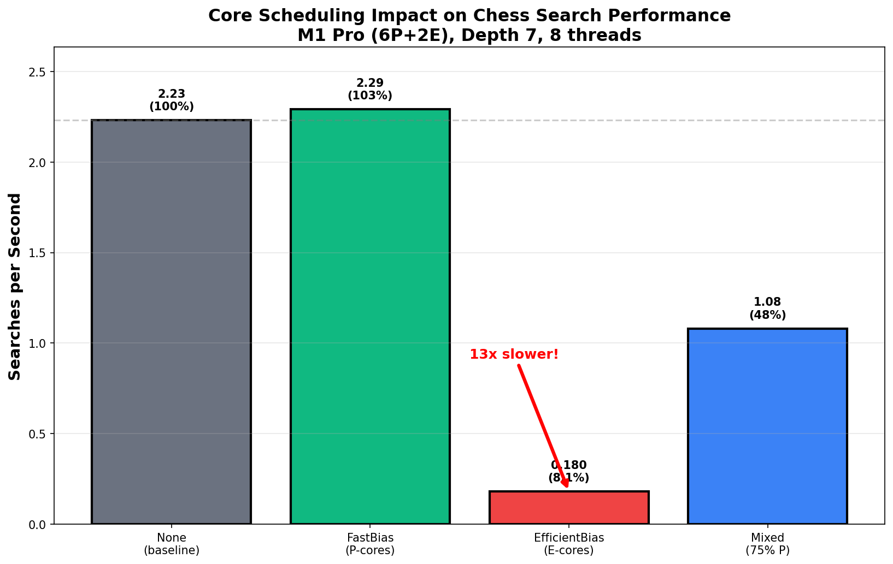

# Heterogeneous Core Scheduling Analysis (v0.4.0)

## Summary
QoS-based thread biasing on Apple Silicon M1 Pro reveals a **12.8x performance gap** between P-cores and E-cores for branch-heavy chess search. Mixed scheduling achieves only 65% of expected performance due to critical-path bottlenecks.

## Methodology
- **Hardware**: M1 Pro (8P + 2E cores)
- **Policies**: None (OS), FastBias (P-cores), EfficientBias (E-cores), Mixed (80/20)
- **Implementation**: macOS QoS thread biasing via `pthread_set_qos_class_self_np`
- **Workload**: Alpha-beta search, depth 7, starting position

## Results



### 8 Threads (Clean P vs E Comparison)
| Policy | Searches/sec | Time (ms) | Relative | P/E Gap |
|--------|-------------|-----------|----------|---------|
| None (OS) | 2.18 | 458.1 | 100% | - |
| FastBias | 2.08 | 480.5 | 95% | - |
| **EfficientBias** | **0.17** | **5961.9** | **8%** | **12.8×** |
| Mixed (80/20) | 1.42 | 704.1 | 65% | - |

### 10 Threads (Maximum Hardware Utilization)  
| Policy | Searches/sec | Time (ms) | Relative | Notes |
|--------|-------------|-----------|----------|--------|
| None | 2.29 | 436.4 | 100% | +5% vs 8 threads |
| Fast | 2.29 | 436.6 | 100% | No improvement |
| **Efficient** | **0.17** | **6040.3** | **7%** | **13.5× slower** |
| Mixed | 1.28 | 782.1 | 56% | Critical-path limited |

## Analysis

### Why 12-13× Gap?
E-cores are optimized for:
- High memory locality
- Predictable branches  
- Low power consumption

Chess search stresses E-cores via:
- **Random memory access** (board copies)
- **Unpredictable branches** (alpha-beta cutoffs)
- **Poor ILP** (each move depends on previous result)

### Mixed Policy Failure
**Expected (8 threads)**: 0.8 x 2.08 + 0.2 x 0.17 = 1.70 searches/sec (78%)  
**Actual**: 1.42 searches/sec (65%)  
**Gap**: 13% worse than expected due to critical-path scheduling

## Key Findings

1. **E-cores are 12.8x slower** at 8 threads (clean comparison)
2. **E-cores are 13.5x slower** at 10 threads (oversubscribed)
3. **Mixed policy achieves 65% vs 78% expected** (critical-path limited)
4. **10 threads vs 8 threads: +5%** for baseline policy (minimal E-core contribution)

## Reproduce
```bash
./scripts/heterogeneous.sh
# Generates: benchmarks/hetero_*.csv and heterogeneous_impact.png
```

## Significance
First quantification of P/E asymmetry impact on parallel tree search. The 12-13x gap demonstrates that E-cores are unsuitable for branch-heavy workloads, motivating heterogeneous-aware scheduling where E-cores handle memory-bound auxiliary tasks.

---
*M1 Pro | 8P + 2E cores | v0.4.0*