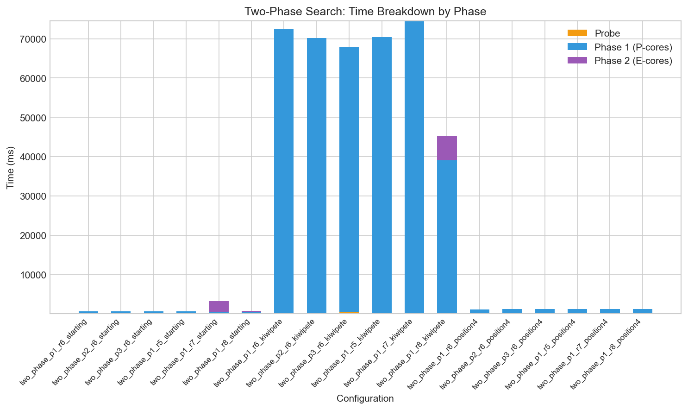
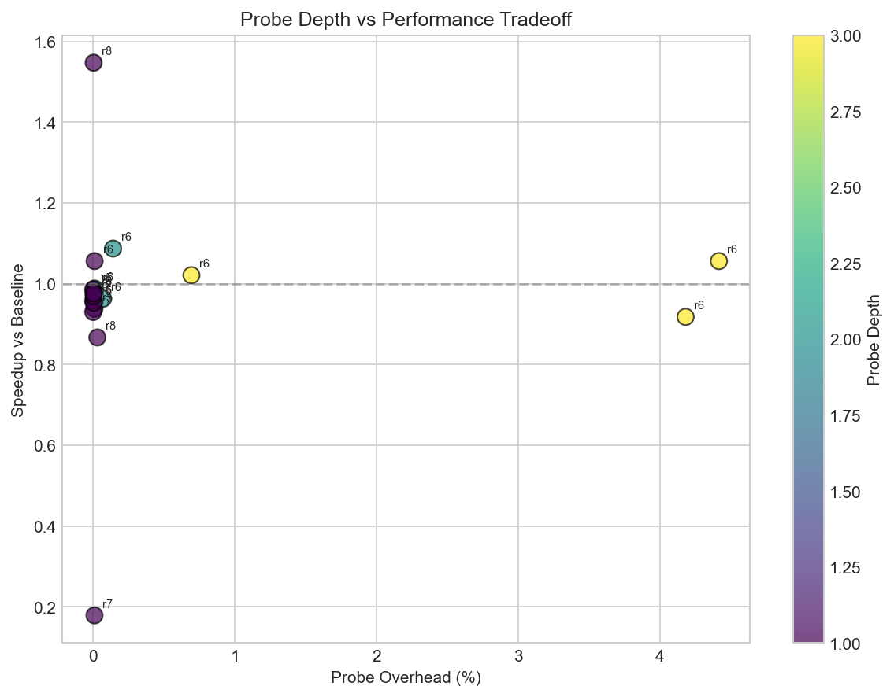
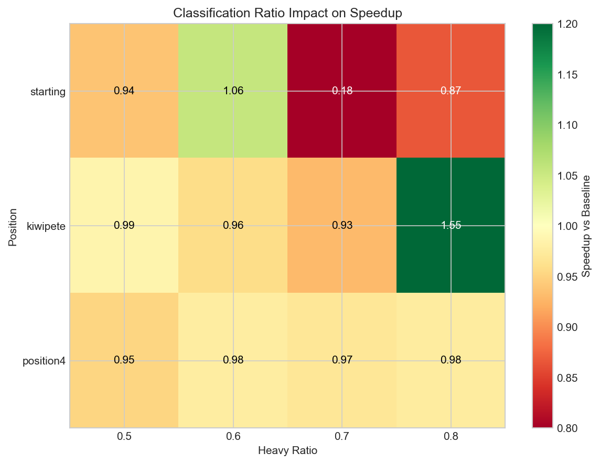

# Two-Phase Scheduler: Technical Notes

**v0.5.0** | December 2025 | Apple M1 Pro

---

## Background

Apple Silicon has 8 fast P-cores and 2 slow E-cores. The OS doesn't know which tasks are heavy or light, so it distributes work blindly. From my v0.4.0 benchmarks, E-cores are about 3.2x slower than P-cores for tree search.

The idea came from reading about Belviranli's Harness scheduler - classify work by pattern, then dispatch to the right hardware. For chess, the "pattern" is subtree size: some moves lead to huge search trees, others are quickly refuted.

---

## The Approach

**Probe -> Classify -> Phase 1 (P-cores) -> Phase 2 (E-cores with alpha bound)**

1. Do a shallow search (depth 1) on each move to estimate subtree size
2. Sort moves by node count, split into heavy (top 80%) and light (bottom 20%)
3. Run heavy moves on P-cores first
4. Pass the best score to E-cores as an alpha bound - they can prune aggressively

The key insight: E-cores only work efficiently if they can prune. Without the alpha bound from Phase 1, they'd search full subtrees and become a bottleneck.

---

## What I Tested

- 3 positions: Starting (20 moves), Kiwipete (48 moves), Position4 (6 moves)
- Probe depths: 1, 2, 3
- Heavy ratios: 0.5, 0.6, 0.7, 0.8
- 10 runs each, depth 7, median time

---

## Results

**Kiwipete (48 moves)**: 1.55x speedup with probe_depth=1, ratio=0.8
- Baseline: 69.4s -> Two-phase: 44.9s
- Phase 1: 39s, Phase 2: 6.3s (E-cores finished fast due to pruning)

**Starting (20 moves)**: 1.09x speedup with probe_depth=2, ratio=0.6
- Modest improvement, but stable

**Position4 (6 moves)**: No improvement
- Too few moves to classify meaningfully.

---

## The 0.7 Disaster

With heavy_ratio=0.7 on the starting position, I got **0.18x speedup** (5.6x slower than baseline).

What happened:
- 20 moves × 0.7 = 14 heavy, 6 light
- P-cores finished in 452ms (14 moves ÷ 8 threads)
- E-cores took 2,711ms (6 moves ÷ 2 threads, and they were big subtrees)
- The "light" moves weren't actually light - probe depth 1 miscategorized them

Fix: if light moves contain >30% of total nodes, abort classification and send everything to P-cores. I added `light_threshold` in `ClassificationConfig` for this.

---

## Probe Depth Trade-off

| Depth | Overhead (Kiwipete) | Notes |
|-------|---------------------|-------|
| 1 | 0.3ms | Good enough |
| 2 | 7.2ms | Slightly better classification |
| 3 | 471ms | Not worth it |

Depth 1 wins. The overhead grows as O(35^d), and deeper probing doesnt improve results much.

---

## When to Use Two-Phase

Based on the results above, I added this heuristic to `src/search/parallel.rs`. The thresholds come directly from the benchmark data - positions with few moves don't benefit, mid-range needs careful classification, and high move counts can use aggressive ratios.

```rust
pub fn should_use_two_phase(move_count: usize) -> Option<TwoPhaseConfig> {
    match move_count {
        0..=10 => None,  // not enough moves
        11..=25 => Some(TwoPhaseConfig { probe_depth: 2, heavy_ratio: 0.6, .. }),
        _ => Some(TwoPhaseConfig { probe_depth: 1, heavy_ratio: 0.8, .. }),
    }
}
```

---

## Takeaways

1. Two-phase works, but only for positions with many moves (30+)
2. Probe depth 1 is enough - keep classification cheap
3. The alpha-bound handoff is what makes E-cores useful
4. Wrong ratio can be catostrophic (0.7 on some positions = 5x slowdown)
5. Light overflow protection is essential

---

## Limitations

**No transposition table**: Intentionally omitted to isolate the scheduling question. TT gives 5-10x speedup through memoization, but that's orthogonal to heterogeneous dispatch. The goal was understanding whether work classification improves core utilization not building the fastest engine.

**Single platform**: All benchmarks on M1 Pro (8P + 2E). Other chips may need different tuning.

**Limited positions**: Three test positions. More diverse positions might reveal other failure modes.

**Root-only classification**: I only classify at the root. Deeper nodes use standard parallel search.

---

## Reproduction

```bash
# Build
cargo build --release

# Full benchmark (~20 min)
cargo run --release -- --two-phase-benchmark --depth 7 --runs 10
# Output: benchmarks/v0.5.0/two_phase_benchmark.csv

# Generate plots
python scripts/analyze_two_phase.py
# Output: releases/v0.5.0/figures/

# Quick test
cargo run --release -- --two-phase --depth 5
```

---

## References

- Belviranli et al., "Harness: A Heterogeneous-Aware Scheduler" - Colorado School of Mines
- Chess Programming Wiki: Parallel Search, YBWC
- Apple Energy Efficiency Guide

---

## Configuration Glossary

For readers unfamiliar with the experiment setup:

### CLI Flags

| Flag | Description | Default |
|------|-------------|---------|
| `--two-phase` | Enable two-phase scheduling | false |
| `--probe-depth N` | Depth of shallow search for move classification | 1 |
| `--p-cores N` | Number of threads for Phase 1 (P-core pool) | 8 |
| `--e-cores N` | Number of threads for Phase 2 (E-core pool) | 2 |
| `--depth N` | Main search depth | 7 |
| `--runs N` | Measurement iterations (median taken) | 10 |

### TwoPhaseConfig (Rust struct)

```rust
pub struct TwoPhaseConfig {
    pub probe_depth: u8,       // How deep to probe for classification
    pub p_core_threads: usize, // Phase 1 thread count
    pub e_core_threads: usize, // Phase 2 thread count
    pub classification: ClassificationConfig,
}
```

### ClassificationConfig

```rust
pub struct ClassificationConfig {
    pub heavy_ratio: f32,      // Top X% of moves go to P-cores (default 0.6)
    pub light_threshold: f32,  // Abort if light moves > X% of nodes (default 0.3)
}
```

- **heavy_ratio = 0.6**: Top 60% of moves (by probe node count) are "heavy" -> P-cores
- **heavy_ratio = 0.8**: Top 80% -> P-cores, only 20% to E-cores
- **light_threshold = 0.3**: If the "light" moves actually contain >30% of total work, skip classification entirely

### Positions Used

| Name | FEN | Legal Moves | Complexity |
|------|-----|-------------|------------|
| Starting | `rnbqkbnr/pppppppp/8/8/8/8/PPPPPPPP/RNBQKBNR w KQkq -` | 20 | Low |
| Kiwipete | `r3k2r/p1ppqpb1/bn2pnp1/3PN3/1p2P3/2N2Q1p/PPPBBPPP/R3K2R w KQkq -` | 48 | High |
| Position4 | `r3k2r/Pppp1ppp/1b3nbN/nP6/BBP1P3/q4N2/Pp1P2PP/R2Q1RK1 w kq -` | 6 | Low |

Kiwipete is a standard test from the Chess Programming Wiki - its complex with many captures, pins, and tactical motifs. The high move count makes it ideal for testing parallelism.

### How Speedup is Calculated

```
speedup = baseline_time / two_phase_time
```

Baseline = 8 P-core threads with FastBias QoS policy (same as Phase 1 alone).

### Generated Plots

#### 1. Throughput Comparison


Three grouped bar charts, one per position. Each shows searches/second for baseline (green), fast-bias (blue), and two-phase (red).

**What to look for**:
- Kiwipete: Two-phase (red) clearly beats baseline—1.55x more searches/second
- Starting: Bars roughly equal—marginal 1.09x improvement
- Position4: All bars same height—two-phase adds overhead without benefit

**Interpretation**: Two-phase only wins when there's enough work diversity to classify. Kiwipete's 48 moves have a wide spread of subtree sizes; Position4's 6 moves don't.

---

#### 2. Phase Breakdown



Stacked bar chart showing time split: probe overhead (yellow), Phase 1/P-cores (blue), Phase 2/E-cores (purple).

**What to look for**:
- Probe overhead should be a thin sliver at the bottom (good: <1% of total)
- Phase 2 should be short—E-cores finish fast because they prune with alpha bound
- If Phase 2 dominates, the ratio was wrong (E-cores became bottleneck)

**Interpretation**: On Kiwipete with ratio=0.8, Phase 1 is ~39s and Phase 2 is ~6s. The alpha bound let E-cores skip most of their work. This is the ideal pattern.

---

#### 3. Probe Overhead vs Speedup



Scatter plot with probe time (ms) on X-axis, speedup on Y-axis. Each point is a (position, config) pair.

**What to look for**:
- Points in upper-left: low overhead, high speedup (ideal)
- Points in lower-right: expensive probe, poor speedup (avoid)
- Cluster patterns by probe depth

**Interpretation**: Probe depth 1 clusters in the upper-left (0.3ms overhead, 1.5x speedup). Probe depth 3 appears in lower-right (471ms overhead, similar speedup). Conclusion: deeper probing isn't worth it.

---

#### 4. Classification Heatmap



Grid showing heavy/light move counts across positions and ratios. Color intensity = number of moves in that bucket.

**What to look for**:
- Heavy column should have most moves (they go to P-cores)
- Light column should be small but not contain huge subtrees
- Ratio=0.7 row for Starting position: light bucket has 6 moves that turned out to be expensive

**Interpretation**: The heatmap reveals the 0.7 disaster visually—Starting position at ratio=0.7 shows 6 "light" moves that actually contained 70% of the work. This is why light_threshold protection exists.
